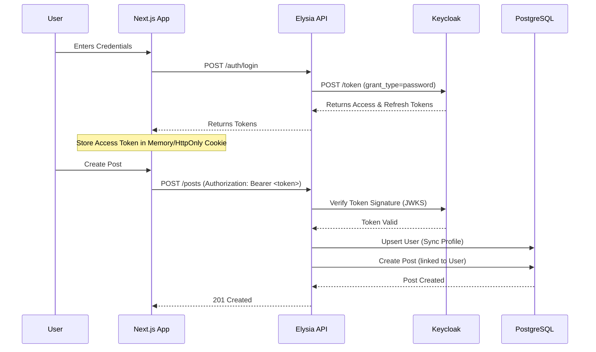

# Keycloak POC Technical Guide

This guide explains the inner workings of the authentication system, middleware, and how to integrate with a frontend application.

## 1. Authentication Service (`auth.service.ts`)

The `authService.login` function handles the exchange of user credentials for Keycloak tokens.

### How it works

1.  **Input**: Accepts `email` and `password`.
2.  **Request**: Sends a `POST` request to Keycloak's token endpoint (`/protocol/openid-connect/token`).
3.  **Content-Type**: Uses `application/x-www-form-urlencoded`, which is required by the OAuth 2.0 spec.
4.  **Parameters**:
    - `grant_type`: Set to `'password'` (Resource Owner Password Credentials Grant).
    - `client_id`: The ID of the client in Keycloak (e.g., `elysia-backend`).
    - `client_secret`: The secret key for the client (required for confidential clients).
    - `username`: The user's email or username.
    - `password`: The user's password.
5.  **Response**: Returns a JSON object containing `access_token`, `refresh_token`, and `expires_in`.

### Keycloak Documentation

- [Keycloak Token Exchange](https://www.keycloak.org/securing-apps/token-exchange)
- [OpenID Connect Core 1.0](https://openid.net/specs/openid-connect-core-1_0.html#TokenEndpoint)

## 2. Authentication Middleware (`auth.middleware.ts`)

The middleware protects routes by verifying the Access Token and ensuring the user exists in the local database.

### How it works

The `authMiddleware` is an Elysia plugin that adds a `derive` step to the request lifecycle.

#### The `derive` function

`derive` allows us to inject new properties into the Elysia `Context`. We use it to inject the `user` object.

1.  **Token Extraction**: Reads the `Authorization` header and extracts the Bearer token.
2.  **Verification (`jose`)**:
    - Uses `jose.jwtVerify` to verify the token's signature against Keycloak's Public Keys (JWKS).
    - Ensures the token is not expired and was issued by the correct realm.
3.  **User Resolution**:
    - Extracts the `sub` (Subject) claim from the token, which is the unique Keycloak User ID.
    - Uses `db.user.upsert` to find the user in the local PostgreSQL database.
    - If the user doesn't exist locally, it creates them using profile data from the token (email, name).
    - If the user exists, it updates their profile data to keep it in sync.
4.  **Context Injection**: Returns `{ user }`, making `context.user` available in all subsequent handlers.

### Accessing the Principal

In your controllers, you can access the current user directly from the context:

```typescript
.get("/", ({ user }) => {
  console.log(user.id); // Access local DB ID
  console.log(user.keycloak_oid); // Access Keycloak ID
  return user;
})
```

## 3. Frontend Integration (Next.js)

### Architecture Overview



### Example: Calling the API from Next.js

Here is a helper function to make authenticated requests:

```typescript
// utils/api.ts
const API_URL = process.env.NEXT_PUBLIC_API_URL || "http://localhost:5556";

export async function fetchWithAuth(
  endpoint: string,
  token: string,
  options: RequestInit = {}
) {
  const headers = {
    "Content-Type": "application/json",
    Authorization: `Bearer ${token}`,
    ...options.headers,
  };

  const response = await fetch(`${API_URL}${endpoint}`, {
    ...options,
    headers,
  });

  if (response.status === 401) {
    // Handle token expiration (e.g., redirect to login or refresh token)
    throw new Error("Unauthorized");
  }

  return response.json();
}
```

#### Usage in a Component

```tsx
// components/CreatePost.tsx
import { useState } from "react";
import { fetchWithAuth } from "../utils/api";

export default function CreatePost({ token }) {
  const [title, setTitle] = useState("");

  const handleSubmit = async (e) => {
    e.preventDefault();
    try {
      const post = await fetchWithAuth("/posts", token, {
        method: "POST",
        body: JSON.stringify({ title, content: "..." }),
      });
      console.log("Post created:", post);
    } catch (err) {
      console.error("Failed to create post", err);
    }
  };

  return (
    <form onSubmit={handleSubmit}>
      <input value={title} onChange={(e) => setTitle(e.target.value)} />
      <button type="submit">Create</button>
    </form>
  );
}
```
